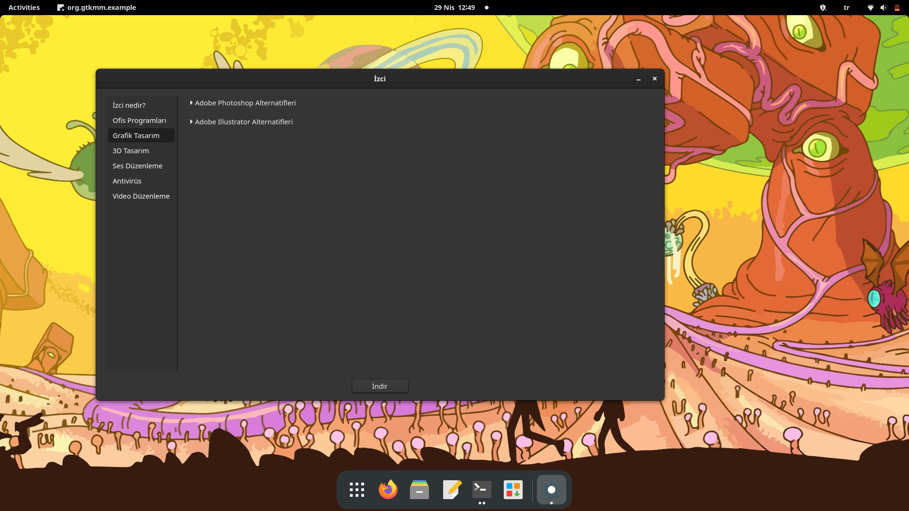

# izci
İzci Pardus işletim sistemi için başlangıç yazılımıdır. Linux türü işletim sistemlerini kullanmaya yeni başlayan biri daha önceden kullandığı programları çalıştıramaz. Alternatif bulması gerekir. Bu da acil işleri, projeleri olan bir kullanıcı için vakit kaybıdır.Bu vakit kaybının yaşanmaması için izci sık kullanılan programların alternatiflerini bulur.   
İzci yeni Pardus kullanıcılarının indirip kullanması için değil Pardus projesinin sahiplerinin bu projeyi yeni kullanıcılara kolaylık sağlamak amacıyla işletim sistemine eklemesi amacıyla yazılmıştır.

### Kurulum Adımları (Pardus Terminal)

**Not** : Öncesinde [gtkmm](https://github.com/GNOME/gtkmm)'nin ve [cmake](https://github.com/Kitware/CMake)'in kurulu olması gerekmektedir. 

1. **Klonlama**  
'''  
git clone https://github.com/theHapalua/izci izci  
'''   
2. **Kurulum**  
'''   
cd izci   
./configure   
'''   
3. **Çalıştırma**  
'''   
izci   
'''   

Bu komut ile yazılımı çalıştırabilirsiniz.   

### Ekran Görüntüleri

